% Blood Donation Prediction
% Danielle Gardner
% May 6, 2019

# Introduction

## Objective

- Analyze data on donation characteristics of blood donors and predict whether donation will be made in the present month

## Background

- Blood donors are from Blood Transfusion Service Center in Hsin-Chu City, Taiwan
- "Present month" is March 2007
- Authors developed dataset to demonstrate application of RFM marketing model
- Data Source: Yeh, I-Cheng, Yang, King-Jang, and Ting, Tao-Ming, "Knowledge discovery on RFM model using Bernoulli sequence," Expert Systems with Applications, 2008. Accessed from UCI Machine Learning Repository.

## Packages Used

- numpy
- pandas
- matplotlib
- seaborn
- scikit-learn
- keras

# Exploratory Data Analysis

## Dataset

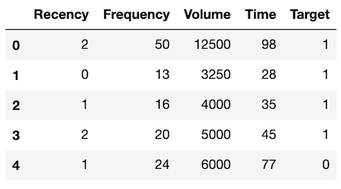

- Data on 748 blood donors

## Variables

- <b>Recency</b>: Months since last donation
- <b>Frequency</b>: Total number of donations
- <b>Volume</b>: Total volume (c.c.) of blood donated
- <b>Time</b>: Months since first donation
- <b>Target</b>: Whether (1) or not (0) the donor made a donation in the present month

## Target

- Distribution of target values:

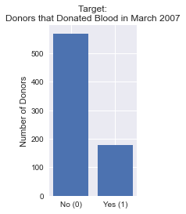

## Recency

- Distribution of recency values:

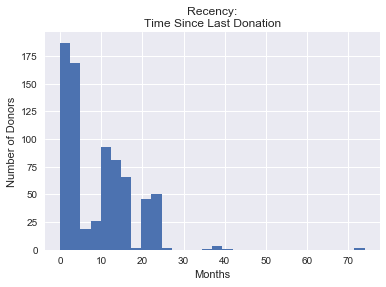

## Frequency

- Distribution of frequency values:

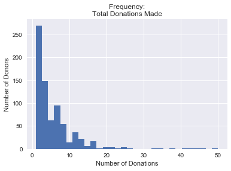

## Time

- Distribution of time values:

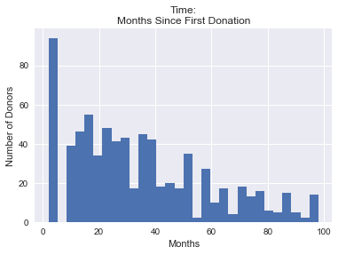

## Attributes by Target Value

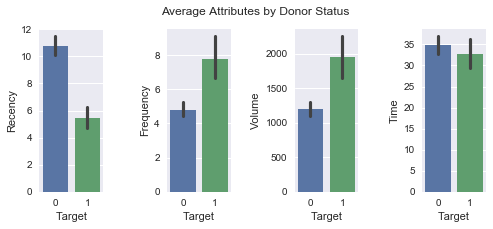

## Pairplot

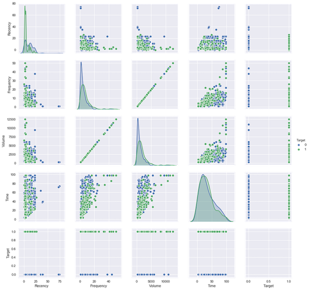

# Machine Learning

## Models

1. Support Vector Classifier (SVC)
2. Logistic Regression (LogReg)
3. K Nearest Neighbors (KNN)

## Hyperparameter Tuning

All models were optimized using GridSearchCV across a range of hyperparameters

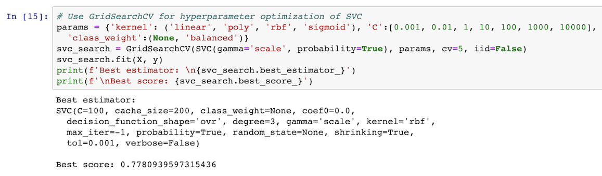

## Measuring Results: Accuracy

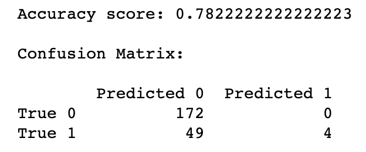

## Measuring Results: ROC

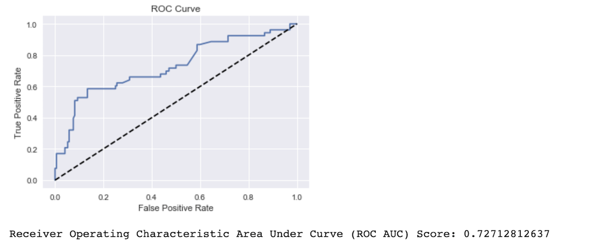

## Results

- Models had accuracy ranging from 0.778 to 0.791
- For comparison, if all target values assumed to be 0, accuracy would be 0.764
- Models had ROC AUC scores ranging from 0.709 to 0.774
- Highest accuracy: <b>K Nearest Neighbors</b>
- Highest ROC AUC: <b>Logistic Regression</b>

# Deep Learning

## Keras Model

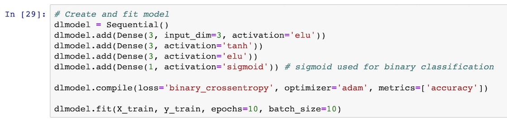
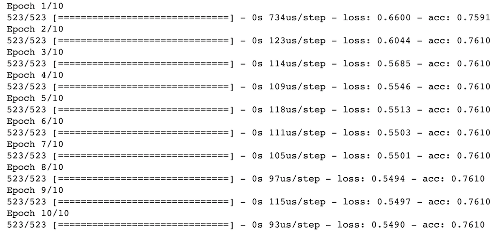

## Results

- No improvement over scikit-learn models tested

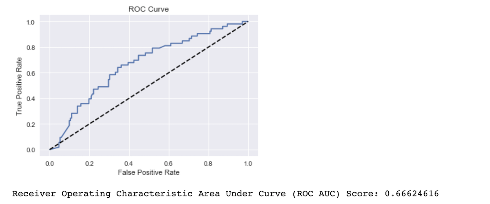

## Conclusions

- Accuracy gains achieved from careful model selection and extensive hyperparameter tuning
- Provided features are limiting: to improve accuracy, try feature engineering or collect data on more features

## Questions?